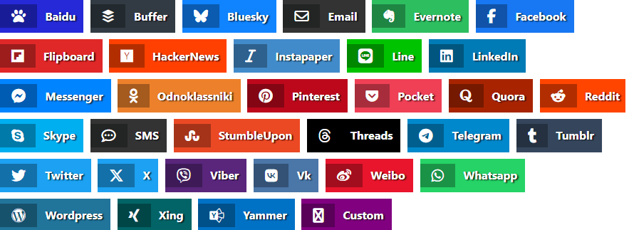

# Vue 3 social sharing

[![npm version][npm-version-src]][npm-version-href]
[![npm downloads][npm-downloads-src]][npm-downloads-href]
[![License][license-src]][license-href]
<a href="https://vuejs.org/"></a>

Style agnostic Vue 3 plugin for social sharing your links on major social networks.
Typescript friendly! <br/>
Basically it's a modern fork of [vue-social-sharing](https://github.com/nicolasbeauvais/vue-social-sharing) library.
If you are using vue 2 you should use that library.

## [Demo page](https://stackblitz.com/edit/vue3-social-sharing-plugin?file=src%2FApp.vue)

## Available networks



`Baidu`
`Buffer`
`Email`
`EverNote`
`Facebook`
`FlipBoard`
`HackerNews`
`InstaPaper`
`Line`
`LinkedIn`
`Messenger`
`Odnoklassniki`
`Pinterest`
`Pocket`
`Reddit`
`Skype`
`SMS`
`StumbleUpon`
`Telegram`
`Threads`
`Tumblr`
`Twitter`
`X`
`Viber`
`VK`
`Weibo`
`WhatsApp`
`Wordpress`
`Xing`
`Yammer`

## Installation 

```bash
# Using pnpm
pnpm add vue3-social-sharing

# Using yarn
yarn add vue3-social-sharing

# Using npm
npm install vue3-social-sharing
```

## Usage

### As composable

```vue
<script setup lang="ts">
  import {useShareLink} from "vue3-social-sharing";
  const {shareLink} = useShareLink();
  const share = () => {
    shareLink({
      network: "facebook",
      url: "https://example.com"
    })
  }
</script>

<template>
  <main>
    <span @click="share">Share on facebook</span>
  </main>
</template>
```

### As Vue plugin

You can use this package as a [regular vue plugin](https://vuejs.org/guide/reusability/plugins.html#introduction). 

```typescript
import Vue3SocialSharingPlugin from "vue3-social-sharing";


const app = createApp(App);
app.use(Vue3SocialSharingPlugin);
app.mount("#app");
```

After you'll be able to use ShareNetwork component in your app like this:
```vue

<share-network
    network="facebook"
    url="https://example.com"
    v-slot="{ share }"
  >
    <span @click="share">Share on Facebook</span>
</share-network>

```
Here you can find [the demo page](https://stackblitz.com/edit/vue3-social-sharing-plugin?file=src%2FApp.vue).

### As renderless component

```vue
<script setup lang="ts">
import { ShareNetwork } from "vue3-social-sharing";
</script>

<template>
  <ShareNetwork
      network="facebook"
      url="https://example.com"
      v-slot="{ share }"
  >
    <span @click="share">Share on Facebook</span>
  </ShareNetwork>
</template>
```

## Available properties

The `url` is the only property required for all networks.


| Prop           | Type   | Description                                                |
|----------------|--------|------------------------------------------------------------|
| `url*`         | String | URL to share.                                              |
| `network*`     | String | Network name.                                              |
| `title`        | String | Sharing title (if available).                              |
| `description`  | String | Sharing description (if available).                        |
| `quote`        | String | Facebook quote (Facebook only).                            |
| `hashtags`     | String | A list of comma-separated hashtags (Twitter and Facebook). |
| `twitter-user` | String | Twitter user (Twitter only).                               |
| `media`        | String | Url to a media (Pinterest, VK, Weibo, and Wordpress).      |


## Custom network

You are able to add your custom network by providing shareNetworks option to the vue plugin.

```typescript
import Vue3SocialSharingPlugin from "vue3-social-sharing";

const app = createApp(App);
app.use(Vue3SocialSharingPlugin, {
  shareNetworks: {
    "my-network": "https://example.com?url=@u&title=@t"
  }
});
app.mount("#app");
```
Available template properties in your link:
- `@u` = url
- `@t` = title 
- `@d` = description
- `@q` = quote
- `@h` = hashtags
- `@m` = media
- `@tu` = twitterUser

You can find a full example in [the demo](https://stackblitz.com/edit/vue3-social-sharing-plugin?file=src%2Fmain.js).

## More examples?

You can find more examples in the playground dir of this repo.

## Feature request

Feel free to open an issue to ask for a new social network support.

## CONTRIBUTING

- Fork the repo
- Create a feature branch with an issue number if it's related to any existing issue
- Run npm install
- Make you changes
- Run the tests `npm run test` (Ofc you can write your own tests if you feel the need)
- Update the [documentation](./README.md)  if needed
- Run `npm run build`, commit your changes and make a pull request.

<!-- Badges -->
[npm-version-src]: https://img.shields.io/npm/v/vue3-social-sharing/latest.svg?style=flat&colorA=18181B&colorB=28CF8D
[npm-version-href]: https://npmjs.com/package/vue3-social-sharing

[npm-downloads-src]: https://img.shields.io/npm/dm/vue3-social-sharing.svg?style=flat&colorA=18181B&colorB=28CF8D
[npm-downloads-href]: https://npmjs.com/package/vue3-social-sharing

[license-src]: https://img.shields.io/npm/l/vue3-social-sharing.svg?style=flat&colorA=18181B&colorB=28CF8D
[license-href]: https://npmjs.com/package/vue3-social-sharing
